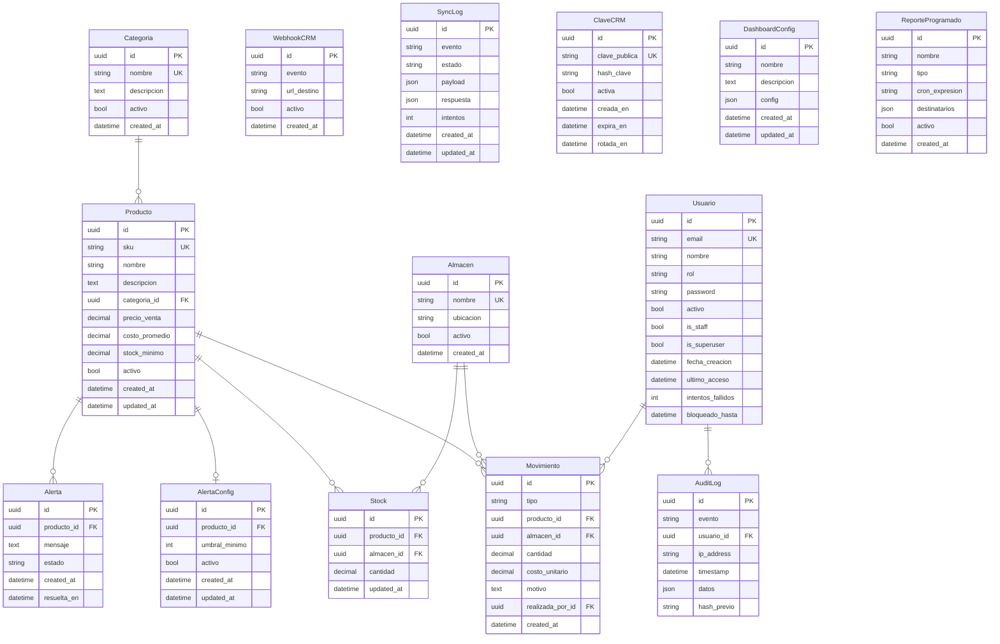

## Diagrama de Entidad-Relación

- **14 modelos** en 6 apps (inventario, usuarios, alertas, auditoria, integracion, metricas)
- Todas las PK son **UUID v4**
- Relaciones clave:
  - `Producto` ↔ `Stock` ↔ `Almacen` (inventario por almacén)
  - `Producto` → `Movimiento` ← `Almacen` / `Usuario` (trazabilidad)
  - `Producto` → `Alerta` (alertas automáticas de stock bajo)
  - `Usuario` → `AuditLog` (cadena de hash inmutables)
- Entidades standalone (sin FK): `WebhookCRM`, `SyncLog`, `ClaveCRM`, `DashboardConfig`, `ReporteProgramado`
