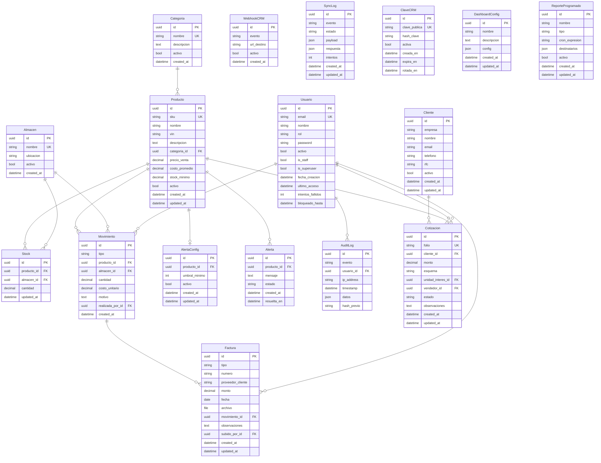

# Diagrama de Entidad-Relación

> Fuente de verdad: modelos Django en `apps/*/models.py`. Actualizado al 2026-08-07.

```mermaid
erDiagram
    Categoria ||--o{ Producto : ""
    Producto ||--o{ Stock : ""
    Almacen ||--o{ Stock : ""
    Producto ||--o{ Movimiento : ""
    Almacen ||--o{ Movimiento : ""
    Usuario ||--o{ Movimiento : ""
    Producto ||--o| AlertaConfig : ""
    Producto ||--o{ Alerta : ""
    Usuario ||--o{ AuditLog : ""
    Cliente ||--o{ Cotizacion : ""
    Producto ||--o{ Cotizacion : ""
    Usuario ||--o{ Cotizacion : ""
    Movimiento ||--o{ Factura : ""
    Usuario ||--o{ Factura : ""

    Categoria {
        uuid id PK
        string nombre UK
        text descripcion
        bool activo
        datetime created_at
    }

    Producto {
        uuid id PK
        string sku UK
        string nombre
        string vin
        text descripcion
        uuid categoria_id FK
        decimal precio_venta
        decimal costo_promedio
        decimal stock_minimo
        bool activo
        datetime created_at
        datetime updated_at
    }

    Almacen {
        uuid id PK
        string nombre UK
        string ubicacion
        bool activo
        datetime created_at
    }

    Stock {
        uuid id PK
        uuid producto_id FK
        uuid almacen_id FK
        decimal cantidad
        datetime updated_at
    }

    Movimiento {
        uuid id PK
        string tipo
        uuid producto_id FK
        uuid almacen_id FK
        decimal cantidad
        decimal costo_unitario
        text motivo
        uuid realizada_por_id FK
        datetime created_at
    }

    Usuario {
        uuid id PK
        string email UK
        string nombre
        string rol
        string password
        bool activo
        bool is_staff
        bool is_superuser
        datetime fecha_creacion
        datetime ultimo_acceso
        int intentos_fallidos
        datetime bloqueado_hasta
    }

    Cliente {
        uuid id PK
        string empresa
        string nombre
        string email
        string telefono
        string rfc
        bool activo
        datetime created_at
        datetime updated_at
    }

    Cotizacion {
        uuid id PK
        string folio UK
        uuid cliente_id FK
        decimal monto
        string esquema
        uuid unidad_interes_id FK
        uuid vendedor_id FK
        string estado
        text observaciones
        datetime created_at
        datetime updated_at
    }

    Factura {
        uuid id PK
        string tipo
        string numero
        string proveedor_cliente
        decimal monto
        date fecha
        file archivo
        uuid movimiento_id FK
        text observaciones
        uuid subido_por_id FK
        datetime created_at
        datetime updated_at
    }

    AlertaConfig {
        uuid id PK
        uuid producto_id FK
        int umbral_minimo
        bool activo
        datetime created_at
        datetime updated_at
    }

    Alerta {
        uuid id PK
        uuid producto_id FK
        text mensaje
        string estado
        datetime created_at
        datetime resuelta_en
    }

    AuditLog {
        uuid id PK
        string evento
        uuid usuario_id FK
        string ip_address
        datetime timestamp
        json datos
        string hash_previo
    }

    WebhookCRM {
        uuid id PK
        string evento
        string url_destino
        bool activo
        datetime created_at
    }

    SyncLog {
        uuid id PK
        string evento
        string estado
        json payload
        json respuesta
        int intentos
        datetime created_at
        datetime updated_at
    }

    ClaveCRM {
        uuid id PK
        string clave_publica UK
        string hash_clave
        bool activa
        datetime creada_en
        datetime expira_en
        datetime rotada_en
    }

    DashboardConfig {
        uuid id PK
        string nombre
        text descripcion
        json config
        datetime created_at
        datetime updated_at
    }

    ReporteProgramado {
        uuid id PK
        string nombre
        string tipo
        string cron_expresion
        json destinatarios
        bool activo
        datetime created_at
        datetime updated_at
    }
```

## Resumen

- **17 modelos** en **9 apps**: `inventario`, `usuarios`, `alertas`, `auditoria`, `integracion`, `metricas`, `clientes`, `cotizaciones`, `finanzas`.
- Todas las PK son **UUID v4**.
- Relaciones clave:
  - `Producto` ↔ `Stock` ↔ `Almacen` (inventario por almacén, `UNIQUE (producto, almacen)`)
  - `Producto` → `Movimiento` ← `Almacen` / `Usuario` (trazabilidad, signo en `SALIDA`)
  - `Producto` → `Cotizacion` ← `Cliente` / `Usuario` (cotizaciones y ventas)
  - `Movimiento` → `Factura` (facturas COMPRA/VENTA ligadas al movimiento)
  - `Producto` → `Alerta` (alertas automáticas de stock bajo)
  - `Usuario` → `AuditLog` (cadena de hash inmutables)

## Restricciones de unicidad e índices relevantes

| Tabla | Restricción |
|---|---|
| `Stock` | `UNIQUE (producto_id, almacen_id)` + check `cantidad >= 0` |
| `AlertaConfig` | `UNIQUE (producto_id)` (producto nullable → también puede haber config global) |
| `Producto` | `sku` UK |
| `Almacen` | `nombre` UK |
| `Categoria` | `nombre` UK |
| `Usuario` | `email` UK |
| `Cotizacion` | `folio` UK |
| `Cliente` | índice en `email` y `rfc` |
| `AuditLog` | índices en `(evento, -timestamp)`, `(usuario, -timestamp)`, `(ip_address, -timestamp)` |
| `Factura` | índices en `(tipo, -fecha)` y `fecha` |

## Entidades standalone (sin FK)

`WebhookCRM`, `SyncLog`, `ClaveCRM` (integración CRM) y `DashboardConfig`, `ReporteProgramado` (métricas).
